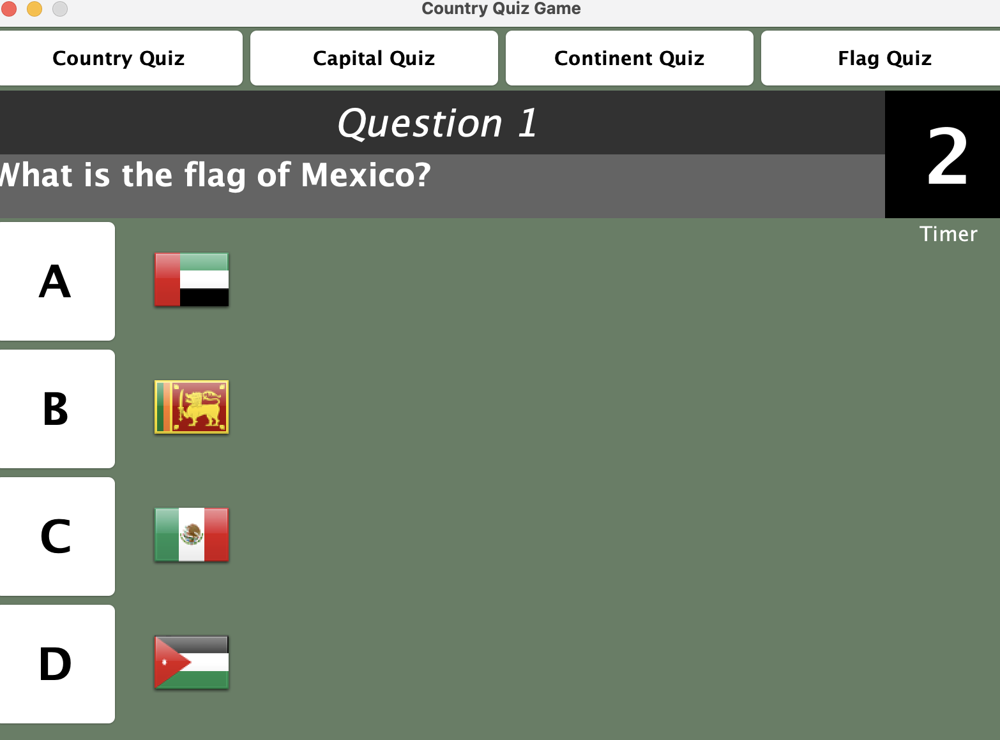

# CountryQuiz
Personal project - Quiz game in Java about countries 

This is a game to help you learn about the different countries by quizzing you about them.

When run, this program plays a game in a Java window where the user can choose from 4 different games
which ask questions to match the country to capital, capital to country, country to continent or country 
to its flag. 

